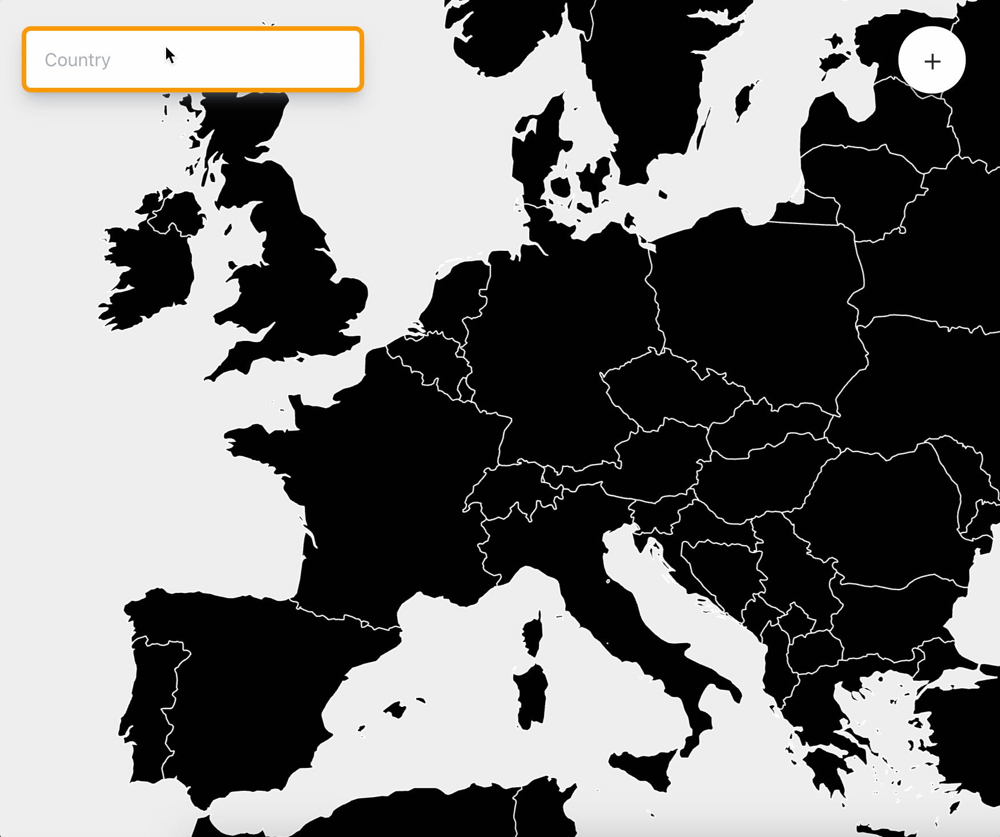
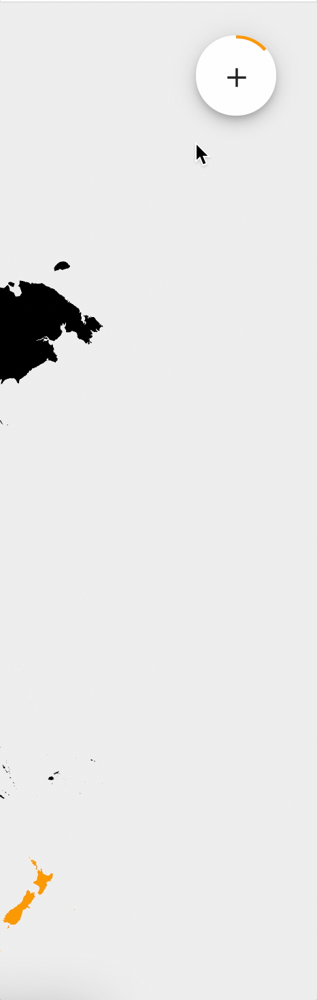

<div align="center">


# Countries of the World Quiz

## [Live Preview](https://countries-of-the-world-gules.vercel.app/)


</div>

#### Table of Contents

- [Features](#Features)
- [Stack](#Stack)

## Features:

#### Dynamic update of map

<div align="center">

```
So that I can keep track of my answers,
I'd like my answers to be highlighted on the map.
```



</div>

&nbsp;

A correct answer is added to an array. Iterating over this array, we look for a SVG path that matches...

```javascript
document.querySelector(`[title="${item.country}"]`);
```

...the color is then updated.

```javascript
document.querySelector(`[title="${item.country}"]`).style.fill = '#FA8F02';
```

#### Progress wheels for total and each continent

<div align="center">

```

So that I can see my progress,
I'd like to know how many countries I have left.

```



</div>

&nbsp;

This feature is a combination of two Material UI components:

- `<SpeedDial />`
- `<CircularProgress />`

I passed the latter as the icon param for the SpeedDial like so:

```javascript
<SpeedDialAction icon={<CircularProgress name="Asia" />}...
```

### Zoom and panning

<div align="center">

```

So that I can see the map clearly,
I'd like to zoom in and pan.

```


</div>

&nbsp;

I used a package called [react-zoom-pan-pinch](https://github.com/prc5/react-zoom-pan-pinch) to move around the SVG.

## Stack

- React
- Testing Library
- Material UI
- Tailwind CSS
- Vercel

| Tool                                                                                                                                                             |                 |
| ---------------------------------------------------------------------------------------------------------------------------------------------------------------- | --------------- |
|                           | React           |
|                                                                          | Testing Library |
|                                                                                              | Material UI     |
|  | Tailwind CSS    |
|               | Vercel          |
